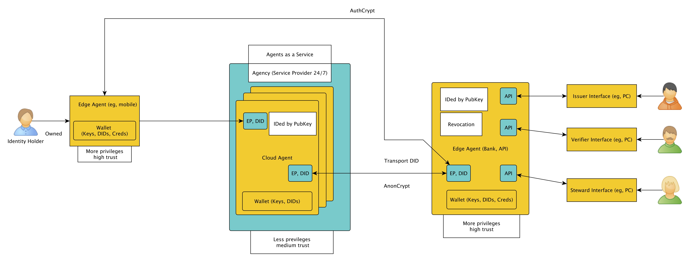
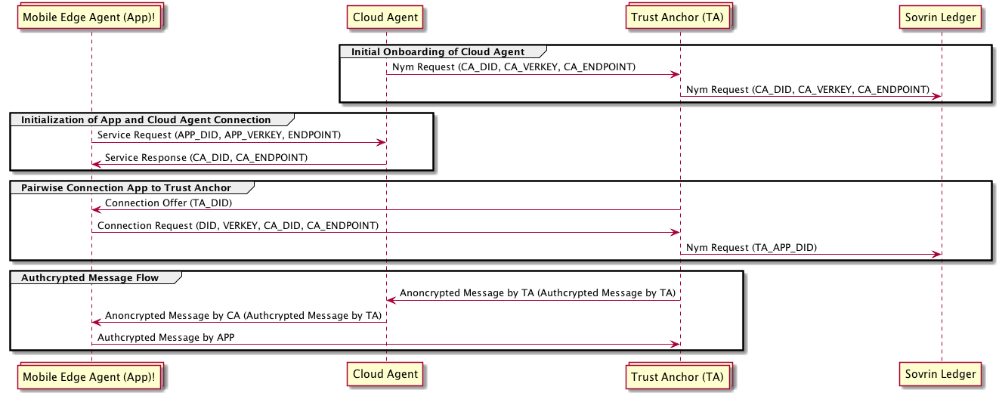

# Overview
The following figure illustrates the overall IDC components also linked to the IndySDK and the ledger. At the top there are the three user interfaces for the issuer, the verifier, and an IDC-AdminUI. They are all accessing the IDC-API, which abstracts the IndySDK for the components. The IDC-Schema-Compiler which can be accessed via the IDC-AdminUI is also integrated in the API. The IDC-CA is an intermediary between the IDC-Mobile-App and the IDC-UIs and API. The IDC-Mobile-App is additionally using the IndySDK Java wrapper to access the ledger directly.

## Software Components

# Cloud Agent Message Flow

This section illustrates the message flow of the Cloud Agent and the corresponding actors.

## Message Formats

### authcrypted

### anoncrypted

### Notes

 - It is assumed that the TA has been previously onboarded and has Trust Anchor privileges to write on the ledger.
 - FCM limits the message payload to 4KB. Messages with payloads >=4KB will be temporarily stored on the CA. The CA provides a unique URL to retrieve the message payload.
 - Follow the Swagger documentation for specific formats on exchanged messages.

## Sequence Flow

1. The IDC-CA requires an initial onboarding from a Trust Anchor (TA) in order to be known on the Ledger. Therefore it sends a connection request to the TA, which should be acknowledged by a connection response. The TA will onboard the CA with a NYM-request, including the CA_DID, the CA_VerificationKey, and the CA_Endpoint, to the ledger.

2. The IDC-Mobile-App sends a connection request to a known CA containing the App_DID, the App_Verification-Key and the Endpoint in form of a Firebase Token. The CA replies a connection response containing the CA_DID and CA_Endpoint which can be used by the APP for further communication.

3. The APP follows the pairwise connection pattern with responding to a TA_Connection_Offer with a Connection_Request and provides the CA_DID, and CA_Endpoint to be reached by the TA alongside its own DID and verification key (App_DID, App_VerKey). The TA sends a NYM_request to the ledger including the TA_APP_DID.

4. The TA sends authcrypted payload messages regarding the APP to the provided IDC-CA_Endpoint anoncrypted with the key of the CA. The CA decrypts the anoncrypted message with it's private key and forwards the payload message anoncrypted to the APP through the provided Firebase Token with FCM. The APP can directly respond to the TA_Endpoint with an authcrypted message.

## Cloud Agent Message Stack
The IDC-CA message stack is as follows. Messages from the IDC-App to the CA are transmitted via https. Messages from the CA to the app are transmitted with Google Firebase messages, unless the message is bigger than XX, in that case the Firebase message includes a link to download the message directly to the app. Messages to the CA from any other application or the API's perspective are done via https. The figure below illustrates the message stack of the CA.

## Working together with other IDC components

## Differences between the Indy/Sovrin CA and IDC CA